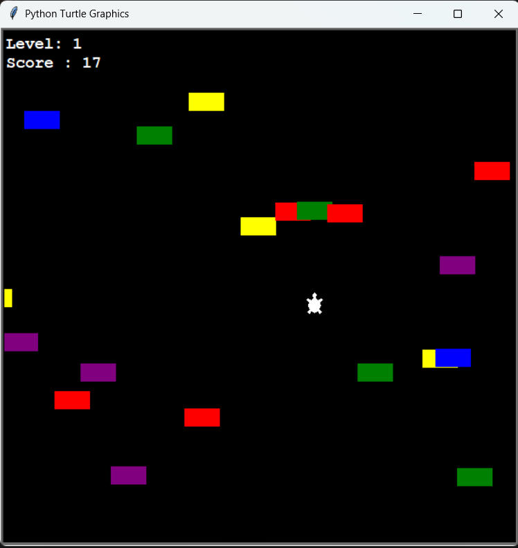

# 🛣️ Turtle Road Crossing Game in Python (Turtle Graphics)

A **Turtle Road Crossing game** built with Python’s `turtle` module.  
Players navigate a turtle across busy traffic without colliding with cars.  

---

## 🎮 Controls

- ⬆ Up Arrow – Move Forward
- ⬇ Down Arrow – Move Backward
- ⬅ Left Arrow – Move Left
- ➡ Right Arrow – Move Right
- Space – Pause / Resume
- V – Restart after Game Over

---

## 🚀 Features

- Dynamic car spawning and movement
- Collision detection
- Level and score tracking
- Pause and restart functionality
- Object-Oriented structure

---

## 🛠️ Technologies Used

- Python 3.11
- turtle
- time
- Object-Oriented Programming
- Docker (for containerization practice)

---

## 📂 Project Structure
```bash
turtle-road-crossing/
│
├── main.py
├── player.py
├── car_manager.py
├── score_board.py
├── requirements.txt
├── Dockerfile
├── docker-compose.yml
└── README.md
```

---

## ▶️ Run Locally (Recommended)

```bash
git clone https://github.com/Fayyaz6137/Road_Crossing_Game_Python.git

cd road-crossing-game-python

pip install -r requirements.txt

python main.py
```

---

## 🐳 Run With Docker

```bash
docker compose up --build
```
⚠️ Since this is a GUI application, running inside Docker requires an X server (e.g., VcXsrv on Windows).

---

## 🖼️ Game Screenshot

